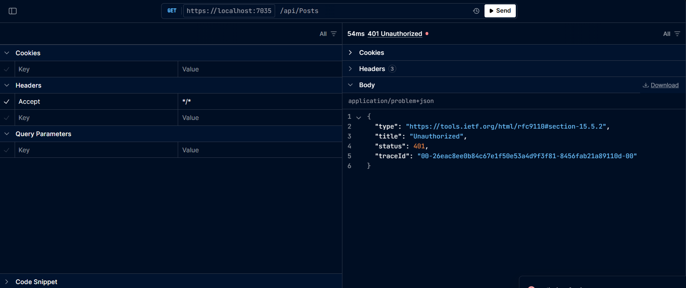
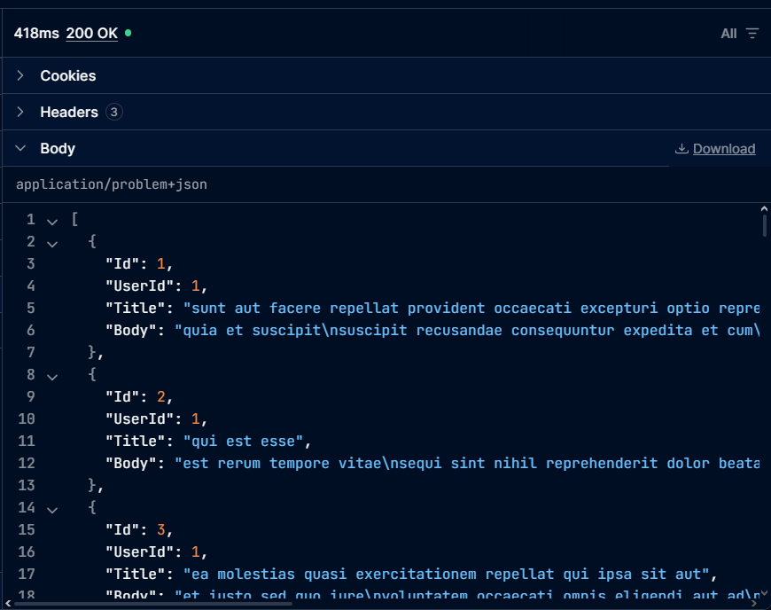
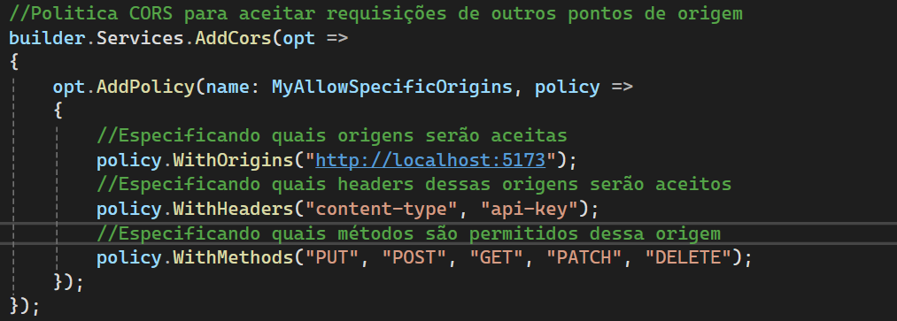
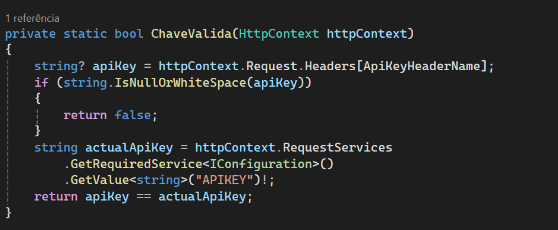

<h1>  API HttpClient</h1>

Este projeto foi construíada para entender melhor sobre a classe HttpClient.

Utilizando a classe HttpClient, é realizado o consumo de uma api dedicada ao apredizado, a qual se chama
jsonplaceholder

<h2>Objetivo</h2>

O principal objetivo deste projeto é familiarizar com consumo de api em asp.net utilizando HttpClient

<h2>O que foi utilizado</h2>
<ul>
	<li>AutoMapper: para mapear dados entre classes;</li>
	<li>Newtonsoft.Json: para realizar serializar e deserializar objetos json;</li>
	<li>Scalar.AspNetCore: nova documentação de api utilizada para substituir Swagger;</li>
</ul>
<h2>Como funciona</h2>

A minha API estabelece um conexão com outra API que se conecta a uma base de dados.

Para realizar requisições, é necessário enviar uma chave API para verificar se está autorizado ou não.

A classe "ApiKeyAuthentication" é responsável por validar a chave enviada no cabeçalho da requisição.

Essa classe foi herda a interface "IAuthorizationFilter" para validar a chave recebida do cabeçalho com a 
chave armazenada nesta API, e também herda da classe "Attribute" para ser utilizada como um atributo nos 
controladores da API.

Implementei uma política de CORS para permitir requisições de um ponto de origem diferente.

Átravés dessa política, defino quais métodos de requisição HTTP e quais valores
de cabeçalho são permitidos dessa origem.

<h2>Documentação Api</h2>
<h3>Requisição não autorizada</h3>

 
<h3>Requisição realizada com sucesso</h3>

 
<h3>Política de Cors</h3>

 
<h3>Validação de chave</h3>
